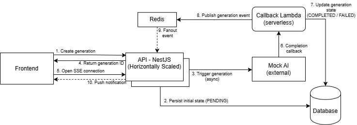

# 1. Introduction & Objective

This document proposes a real-time notification system to inform users when an image
generation request is completed. Currently, users must poll the API to check the generation
status, which negatively impacts user experience. The objective is to design a simple,
scalable, and reliable way for the API to notify the Frontend when a generation reaches a
final state. This proposal focuses only on the interaction between the Frontend and the API
and does not cover communication with the AI generation engine.

# 2. Requirements & Assumptions

The system must deliver asynchronous notifications when a generation reaches a final state
(COMPLETED or FAILED). Notifications should be near real-time and remove the need for
client-side polling. The design must handle users being offline at the time of completion and
support horizontal scaling across multiple API instances. The database remains the source of
truth for generation state.

# 3. High-Level Architecture

The proposed architecture introduces a real-time notification layer between the API and the
Frontend using Server-Sent Events (SSE) and Redis Pub/Sub. The database remains the
source of truth for generation state, while Redis is used to broadcast completion events
across API instances.
When a user initiates a generation request, the API creates a generation record with a
PENDING status and returns the generation identifier to the client. The Frontend then
establishes an SSE connection to the API, subscribing to updates for that specific
generation. Once the generation process completes, the callback Lambda updates the
generation status in the database and publishes a completion event to a Redis channel.
All API instances subscribe to the Redis channel and listen for generation completion events.
When an event is received, the instance handling the corresponding SSE connection
forwards the notification to the client. If the client is disconnected, no state is lost, as the final
generation status can be retrieved through the existing GET endpoint upon reconnection.
The complete interaction between components is illustrated in the architecture diagram
below.




**Message Schema**
Redis events carry minimal metadata required to identify the affected generation:
```
{
"event": "GENERATION_STATUS_UPDATED",
"generationId": "uuid",
"status": "COMPLETED"
}
```
# 4. Technology Choices & Rationale

**Why not polling**
Client-side polling represents the most straightforward and intuitive approach to track
generation status, requiring no persistent connections or additional infrastructure. However, it
introduces unnecessary latency, increases API load due to repeated requests, and results in
a suboptimal user experience. Given the asynchronous nature of image generation, a
push-based approach is more suitable for delivering timely updates.
**Redis Pub/Sub vs Kafka**
Redis Pub/Sub was selected as the internal event distribution mechanism due to its
simplicity, low latency, and minimal operational overhead. Kafka was considered but not
chosen, as its durability guarantees, message retention, and replay capabilities exceed the
requirements of this use case. The system does not rely on event history or strict ordering,
and generation state is persisted in the database, making Redis a more appropriate and
lightweight choice.
**SSE vs WebSocket***
Server-Sent Events (SSE) was selected over WebSockets because the communication
pattern is strictly server-to-client. SSE provides native browser support, automatic
reconnection, and integrates naturally with existing HTTP infrastructure. WebSockets were
deemed unnecessary given the lack of bidirectional communication requirements and the
additional complexity they introduce in connection management and scaling.


# 5. Reliability Concerns

**Error handling**
Failures during the generation process are explicitly handled by transitioning the generation
to a terminal FAILED state in the database. Errors occurring in the notification pipeline
(Redis or SSE delivery) do not affect generation consistency, as state transitions are
persisted independently. Transient infrastructure failures are tolerated by relying on retry
mechanisms and by decoupling state changes from event delivery.
**Offline user handling**
Users may be offline or disconnected when a generation completes. In such cases, real-time
notifications may not be delivered, but no state is lost. The system treats SSE notifications as
best-effort signals, while the database remains the authoritative source of truth. Upon
reconnection, the Frontend can retrieve the final generation state via the existing GET
endpoint and update the user interface accordingly.
**Delivery guarantees**
The notification mechanism provides at-least-once delivery at the infrastructure level but
does not guarantee event persistence or replay. Duplicate notifications are tolerated and can
be safely handled by the client using the generation identifier and current status. This
trade-off simplifies the architecture while maintaining correctness, as delivery guarantees are
ultimately enforced through persisted generation state rather than transient events.

# 6. Scaling & Security Considerations

**Scaling considerations**
The proposed design supports horizontal scaling by keeping API instances stateless and
using Redis Pub/Sub to distribute events across instances. SSE connections are handled per
instance and scale naturally by adding more API replicas. The database remains the source
of truth, ensuring consistency regardless of event delivery. Practical limits such as connection
caps and basic rate limiting are sufficient to mitigate excessive resource usage at this stage.
**Security considerations**
Access to SSE endpoints should be restricted to authenticated users, and authorization
must ensure that clients can only subscribe to events related to their own generations. All
communication is assumed to occur over HTTPS. Event payloads are intentionally minimal to
reduce the risk of exposing sensitive information. Standard API protections such as rate
limiting and request validation are considered adequate for this design.

# 7. Trade-offs, Alternatives & Complexity

Choosing SSE over WebSockets reduces implementation complexity and operational
overhead by relying on standard HTTP infrastructure and avoiding bidirectional connection
management. This simplifies both development and maintenance while still meeting the
functional requirements. WebSockets remain a viable alternative if future use cases require
client-to-server messaging.


Using Redis Pub/Sub instead of Kafka significantly lowers operational cost and infrastructure
complexity. Redis can be easily managed or consumed as a managed service, whereas
Kafka introduces additional operational burden, including cluster management, monitoring,
and storage considerations, which are not justified for the current scale and requirements.
Overall implementation complexity is moderate and aligns well with the existing technology
stack. The solution requires minimal additional components and leverages well-understood
patterns. Operational costs remain low, with resource usage primarily driven by concurrent
SSE connections and Redis throughput, both of which scale predictably and can be
optimized incrementally as usage grows.


